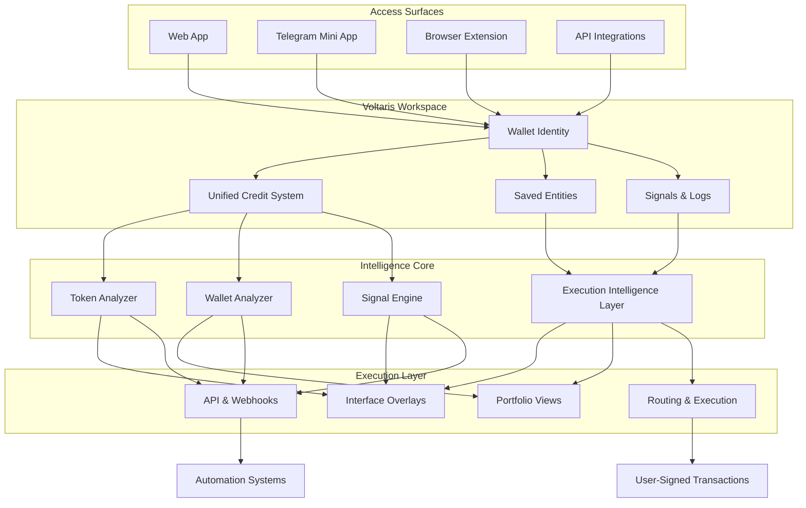

<p align="center">
  
</p>

<h1 align="center">Voltaris Terminal</h1>

<div align="center">
  <p><strong>AI-native execution intelligence and trading terminal for Solana</strong></p>
  <p>
    Token analytics • Wallet profiling • Signal interpretation • Execution overlays • Credit-based workflow
  </p>
</div>

<div align="center">

[](https://your-web-app-link)
[](https://t.me/your_mini_app)
[](https://your-docs-link)
[](https://x.com/your_account)
[](https://t.me/your_group_or_channel)

</div>

> [!IMPORTANT]
> Voltaris Terminal is built around one core principle: execution clarity before action

## One-Line Value

Voltaris Terminal transforms fragmented on-chain data into actionable execution intelligence inside one unified environment

## Why It Wins

Most tools surface charts and leave interpretation to the user  
Voltaris focuses on decision readiness and execution context

Instead of switching between explorers, bots, dashboards, and notes, Voltaris keeps token structure, wallet behavior, and signal interpretation in one continuous flow

The system reduces cognitive load by translating raw blockchain activity into structured outputs that can be acted on instantly

> [!TIP]
> The shift is not about faster data, but clearer execution

## Product View

Voltaris operates as a unified terminal layer across multiple surfaces



## Live Output

Voltaris produces structured outputs designed for immediate interpretation

| Input | Agent | Output |
|---|---|---|
| Token | Token Analyzer | Liquidity state, volatility profile, holder distribution, risk flags |
| Wallet | Wallet Analyzer | Performance metrics, exposure, behavior patterns, drawdowns |
| Signals | Signal Engine | Volume spikes, momentum shifts, anomaly detection |

> [!NOTE]
> Voltaris uses async job execution for scalable API workflows

## Quick Start

### 1 Connect wallet

Sign a message using a supported Solana wallet

### 2 Activate credits

Credits are linked to your wallet and power all analysis

### 3 Run analysis

Trigger token or wallet analysis and receive structured insights

> [!IMPORTANT]
> Voltaris is non-custodial and never accesses private keys

## Core Modules

| Module | Function | Value |
|---|---|---|
| Voltaris Core | Aggregates on-chain signals | Real-time visibility |
| Execution Intelligence | Evaluates risk and behavior | Better decisions |
| AI Agents | Interpret data streams | Reduced complexity |
| Credit System | Powers usage | Scalable access |
| Developer Layer | API and webhooks | Integration ready |

## How It Works

1 Connect wallet  
2 Activate credits  
3 Run analysis  
4 Interpret structured output  
5 Execute or automate  

## Access Paths

| Path | Use Case | Value |
|---|---|---|
| Web App | Full terminal | Complete workflow |
| Telegram | Quick access | Fast signals |
| Extension | Context overlay | Inline insights |
| API | Automation | System integration |

## API Example

```bash
curl -X POST https://api.voltaris.ai/v1/agents/run \
  -H "Authorization: Bearer YOUR_API_KEY" \
  -H "Content-Type: application/json" \
  -d '{
    "agent_id": "wallet-analyzer",
    "params": {
      "wallet": "WALLET_ADDRESS",
      "network": "solana"
    }
  }'
```

## Network Coverage

| Network | Status |
|---|---|
| Solana | Active |
| BNB Chain | Planned |
| Base | Planned |

## Credit Model

Voltaris uses a unified credit system linked to wallet identity

| Layer | Role |
|---|---|
| Wallet | Identity |
| Credits | Usage unit |
| Token | Utility activation |

## Plans

| Plan | Credits | Access |
|---|---|---|
| Free | 10 | Basic |
| Starter | X | Core |
| Pro | Y | Extended |
| Builder | Z | Full |

## Limitations

Voltaris does not remove market risk  
It improves clarity and execution awareness

> [!CAUTION]
> Not financial advice

## Best Fit

| Good | Not ideal |
|---|---|
| Active traders | Chart-only users |
| Solana users | Custody seekers |
| Builders | Passive users |

## Trust

- Non-custodial  
- Wallet-based auth  
- No private key access  
- Explicit transaction signing  

## Disclaimer

Voltaris provides analytics and execution support tools  
Users remain responsible for all decisions
